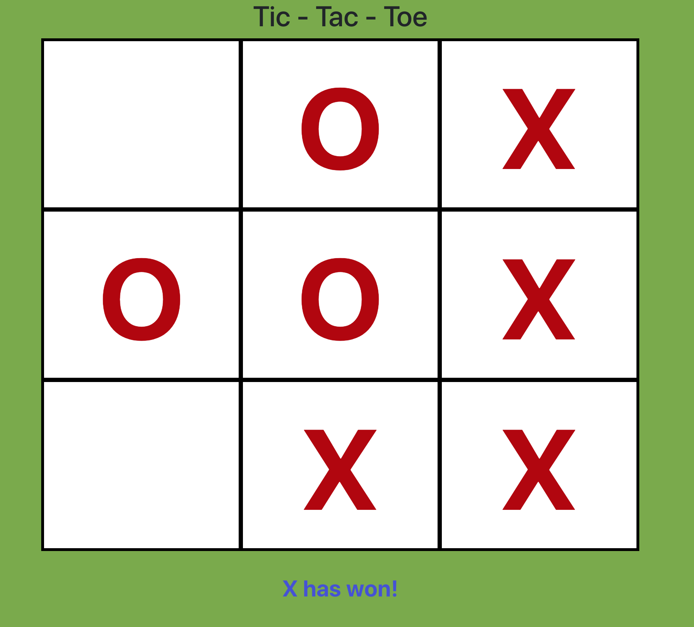

## Preview to App

## Link to Case Study
[click here to view the case study](case-study.md)

## Available Scripts

In the project directory, you can run:

### `npm run start`

Runs the app in the development mode. 
Open [http://localhost:3000](http://localhost:3000) to view it in the browser.

The page will reload if you make edits. 
You will also see any lint errors in the console.

### `npm run test`

Launches the test runner in the interactive watch mode. 
See the section about [running tests](https://facebook.github.io/create-react-app/docs/running-tests) for more information.

### `serverless deploy`

Will deploy your application to be hosted by AWS. **Requires to create `.env` file that has the same outline as in the `setup.env` file with AWS credentials.** 